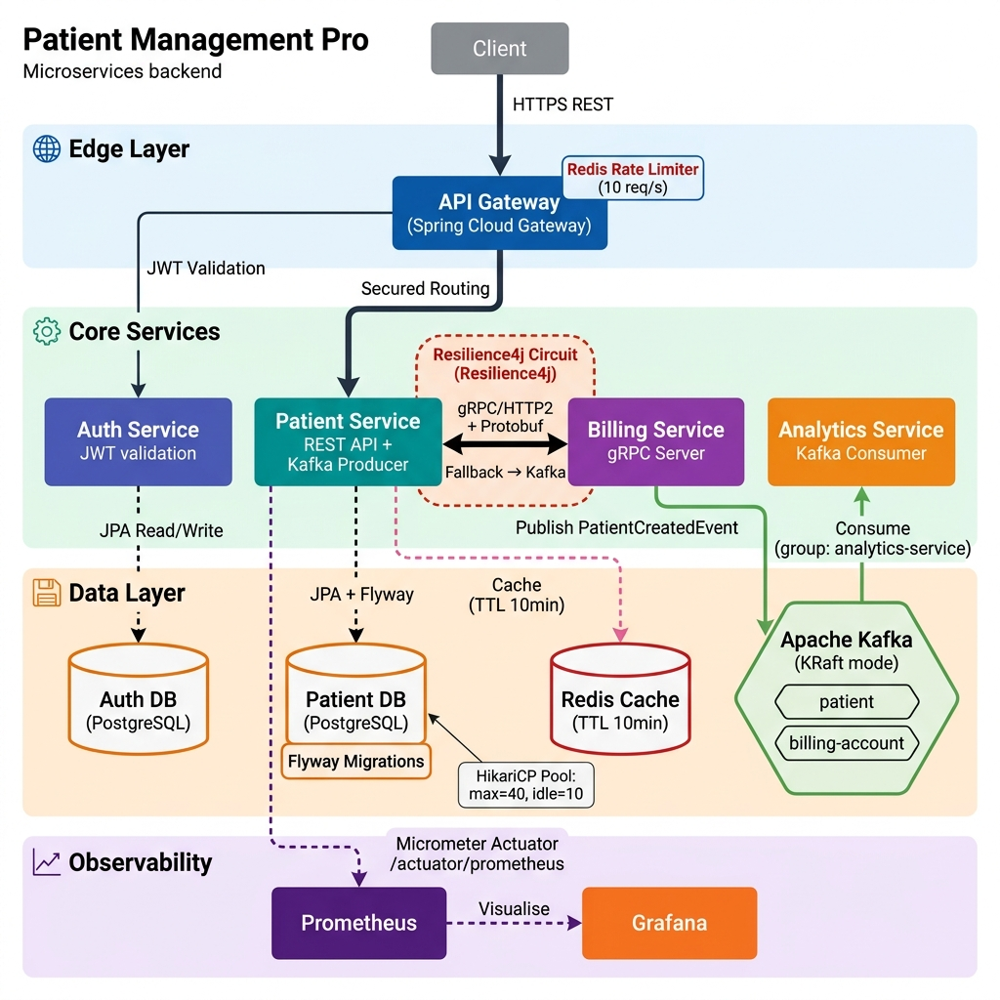

# 🏥 Patient Management Pro (Microservices Backend)

     

> A production-ready, distributed microservices backend for patient lifecycle management. Built with modern engineering practices including secure edge APIs, asynchronous event messaging, synchronous gRPC communication, robust caching, deep observability, and complete CI/CD automation.

---

## 🌟 Engineering Highlights

This project is carefully crafted to demonstrate enterprise-grade backend engineering, making it an excellent showcase for technical recruiters and open-source contributors alike.

- **Distributed Architecture:** 5 highly-decoupled microservices (`api-gateway`, `auth`, `patient`, `billing`, `analytics`) with independent databases and strict bounded contexts.
- **Mixed Communication Models:** REST at the edge, **gRPC** + Protobuf for high-speed internal synchronous calls, and **Apache Kafka** for scalable, asynchronous event-driven processing.
- **Enterprise Security & Reliability:** Stateless JWT authentication, API Gateway edge routing, Redis-backed rate limiting, and Resilience4j circuit breaker patterns.
- **Deep Observability:** Complete monitoring pipeline exposing JVM and application metrics via Micrometer, scraped by **Prometheus**, and visualized in **Grafana**.
- **Platform Automation:** Fully containerized environment spinning up multiple interconnected containers via `docker-compose`. Backed by automated GitHub Actions and Jenkins CI/CD pipelines.
- **Quality Assurance:** Covered by automated end-to-end integration tests (`integration-tests/`) and rigorous `k6` load testing scenarios (`performance-test/`).

---

## ⚡ Quick Start Demo (7 Minutes)

A streamlined guide to bringing the platform up, validating the core flows, and testing the observability stack.

### 1) Start the platform

```powershell
Copy-Item .env.example .env
docker compose up --build -d
```

### 2) Login and capture JWT token

Open `api-request/auth-service/login.http` and run it from the IDE HTTP client.

- Endpoint: `POST http://localhost:4004/auth/login`
- Token is stored as `{{token}}` by the request script

### 3) Call protected APIs

Run these files in order:

1. `api-request/patient-service/create-patient.http`
2. `api-request/patient-service/get-patients.http`

If you want to validate the token directly, run `api-request/auth-service/validate.http`.

### 4) (Optional) Check observability

- Prometheus: `http://localhost:9090`
- Grafana: `http://localhost:3000`

### 5) Stop the platform

```powershell
docker compose down
```

## 🗺️ System Architecture



> **Diagram guide:** Solid thick arrows are primary data paths. Thin arrows are supporting/validation flows. Dashed arrows are data reads/writes and metric scrapes. The red dashed box on the gRPC path represents the active Circuit Breaker.

### Communication Matrix

| # | From | To | Protocol | Pattern | Notes |
|---|---|---|---|---|---|
| 1 | Client | API Gateway | HTTPS REST | Synchronous | Rate limited: 10 req/s via Redis |
| 2 | API Gateway | Auth Service | HTTP | Synchronous | JWT token validation on `/auth/**` |
| 3 | API Gateway | Patient Service | HTTPS REST | Synchronous | JwtValidation filter on `/api/patients/**` |
| 4 | Patient Service | Billing Service | **gRPC** (HTTP/2 + Protobuf) | Synchronous | **Circuit Breaker** (50% failure threshold, 10s open) + **Retry** (2 attempts, 500ms wait) |
| 4a | Patient Service | Kafka `billing-account` | Kafka Produce | Async (Fallback) | Circuit Breaker fallback: publishes `BillingAccountEvent` when gRPC fails |
| 5 | Patient Service | Kafka `patient` | Kafka Produce | Asynchronous | `PatientCreatedEvent` published on every patient creation |
| 6 | Apache Kafka | Analytics Service | Kafka Consume | Asynchronous | Consumer group: `analytics-service`, offset: earliest |
| 7 | Patient Service | Prometheus | HTTP Actuator | Pull-based | Micrometer + custom `custom.redis.cache.miss` counter via AOP |

## 🔬 Technology Choices: Why & How

### Spring Boot 3.x & Java
* **Why:** Industry standard for enterprise microservices. It offers a massive ecosystem, fast development via auto-configuration, and robust community and corporate support.
* **How:** Used as the foundational framework across all 5 microservices (`api-gateway`, `auth`, `patient`, `billing`, `analytics`), with Java 17 for the backend services. Each service runs independently with its embedded Tomcat/Netty server.

### Spring Cloud Gateway
* **Why:** Provides a simple, effective way to route traffic to underlying APIs while providing cross-cutting concerns (security, monitoring, resiliency) at the edge.
* **How:** Implemented in `api-gateway`. It acts as the single entry point, routing requests to `auth-service` and `patient-service`, and applies Redis-backed request rate limiting to prevent abuse.

### JWT (JSON Web Tokens) & Spring Security
* **Why:** Enables stateless authentication. In a distributed backend, maintaining server-side sessions across multiple instances or hitting a central DB for every request validation is a massive bottleneck.
* **How:** The `auth-service` generates a cryptographically sealed JWT upon correct login. The `api-gateway` and downstream services validate the token locally without needing to query a database.

### Apache Kafka & Event-Driven Architecture
* **Why:** To decouple the critical write path from downstream processes. This ensures core APIs remain highly available and fast even if downstream services (like analytics) are slow or offline.
* **How:** `patient-service` acts as a producer, publishing event messages (e.g., `PatientCreatedEvent`) to a Kafka topic. The `analytics-service` consumes these topics to process metrics asynchronously, ensuring eventual consistency.

### gRPC & Protocol Buffers
* **Why:** We need high-performance, strictly typed internal communication between services. gRPC uses HTTP/2 and binary Protobufs, which offer smaller payloads and significantly faster serialization than JSON over REST.
* **How:** Used for synchronous inter-service communication where an immediate response is required. The `patient-service` calls the `billing-service` (gRPC server) to immediately provision/check billing accounts during patient onboarding.

### PostgreSQL (Per-Service Database)
* **Why:** Using the "Database-per-service" pattern ensures loose coupling. If one service's schema changes, or its database is under load, other services are entirely unaffected.
* **How:** `auth-service` and `patient-service` each have isolated, separate PostgreSQL containers orchestrated via Docker (`auth-service-db`, `patient-service-db`). They interact via Spring Data JPA.

### Redis
* **Why:** Excellent for ultra-fast in-memory data storage to avoid repeated heavy DB queries, and perfectly suited for atomic distributed rate-limit counters.
* **How:** Used for two distinct purposes:
  1. **Rate Limiting:** `api-gateway` uses Spring Cloud Gateway's `RequestRateLimiter` filter backed by Redis — configured at 10 `replenishRate` / 10 `burstCapacity` requests per second per IP (`ipKeyResolver`).
  2. **Caching:** `patient-service` has a custom `RedisCacheConfig` (`@EnableCaching`) with a 10-minute TTL and Jackson JSON serialization for cache entries.

### Resilience4j (Circuit Breaker + Retry)
* **Why:** In a distributed system, gRPC calls to `billing-service` can fail due to network issues or service restarts. Without a circuit breaker, a degraded downstream service can cascade failures up the call chain, taking down the entire patient creation flow.
* **How:** The `BillingServiceGrpcClient.createBillingAccount()` method is decorated with:
  - `@CircuitBreaker(name="billingService", fallbackMethod="billingFallback")` — Opens the circuit at 50% failure rate over a sliding window of 10 calls. Stays open for 10 seconds, then moves to half-open (allows 3 test calls).
  - `@Retry(name="billingRetry")` — Retries up to 2 times with a 500ms wait before triggering the circuit breaker.
  - **Fallback:** `billingFallback()` publishes a `BillingAccountEvent` to the Kafka `billing-account` topic, ensuring billing provisioning is never lost — it's just deferred asynchronously.

### Prometheus & Grafana (Observability)
* **Why:** You cannot optimize or debug what you cannot see. In distributed systems, pinpointing failures or performance bottlenecks requires centralized metric collection.
* **How:** We expose `/actuator/prometheus` endpoints in our microservices using Micrometer. Prometheus periodically scrapes these endpoints. Grafana connects to Prometheus to render beautiful, actionable dashboards for request latency, errors, and JVM metrics.

### Docker & Docker Compose
* **Why:** To eliminate "it works on my machine" issues and ensure environments are reproducible. Containerization guarantees that the code runs precisely the same way in development, testing, and production.
* **How:** Every service has a `Dockerfile`. The entire multi-service ecosystem (5 services, 2 DBs, Redis, Kafka, Prometheus, Grafana) spins up cleanly with a single `docker compose up` command.

## Tech Stack

| Category | Technology | Detail |
|---|---|---|
| Language | Java 17 | All 5 microservices (Java 21 for `infrastructure` module) |
| Framework | Spring Boot 3.x | Each service has its own embedded server |
| Gateway | Spring Cloud Gateway (Reactive) | Routes, JwtValidation filter, Redis rate limiter |
| Security | Spring Security + JWT (`jjwt`) | Stateless token validation |
| Messaging | Apache Kafka (KRaft mode) + Protobuf | Topics: `patient`, `billing-account` |
| RPC | gRPC (`grpc-spring-boot-starter`) | Patient → Billing over HTTP/2 + Protobuf |
| Datastore | PostgreSQL 15 | Per-service isolated DB instances |
| Schema Migrations | Flyway (`flyway-core` + `flyway-database-postgresql`) | Patient service DB migrations |
| Cache | Redis 7.2 | TTL 10min, Jackson JSON serializer |
| Connection Pool | HikariCP | max=40, min-idle=10, timeout=30s |
| Resilience | Resilience4j (Circuit Breaker + Retry) | On gRPC billing call; fallback to Kafka |
| Observability | Actuator + Micrometer + Prometheus + Grafana | Custom AOP counter: `custom.redis.cache.miss` |
| Testing | JUnit 5, RestAssured, k6 | Integration + load tests |
| Containers | Docker, Docker Compose (v3.8) | One-command full-stack startup |
| IaC | AWS CDK | In `infrastructure/`; deploys via LocalStack |
| CI/CD | GitHub Actions + Jenkins | Matrix builds, Docker image builds, integration tests |

## 📈 Engineering Impact

| Area | What Was Built | Why It Matters |
|---|---|---|
| 🏗️ **Architecture** | 5 decoupled microservices behind an API Gateway with independent PostgreSQL DBs and strict bounded contexts | Demonstrates production-grade system design with independent deployability and zero shared state |
| 🔒 **Security** | Stateless JWT auth via `auth-service`; custom `JwtValidation` filter on the API Gateway for all patient routes | Eliminates session-state bottlenecks; scales horizontally without sticky sessions |
| ⚡ **Inter-Service Comms** | gRPC + Protobuf for synchronous calls; Apache Kafka (2 topics) for async event-driven messaging | Mixed model proves real-world trade-off analysis — speed vs. decoupling |
| 🛡️ **Resilience** | Resilience4j `@CircuitBreaker` (50% threshold, 10s open) + `@Retry` (2 attempts) on the gRPC path; graceful Kafka fallback | Proves understanding of production failure modes — the system degrades gracefully rather than crashing |
| 🚀 **Performance** | Redis cache (TTL 10min) on patient reads + Redis-backed `RequestRateLimiter` (10 req/s) + HikariCP pool (max 40) | Multilayer performance strategy: edge protection, in-memory caching, and DB connection efficiency |
| 🔭 **Observability** | Micrometer → Prometheus scrape pipeline + custom AOP `cache.miss` counter + Grafana dashboards | Full production visibility without a third-party APM |
| 🧪 **Quality** | RestAssured integration tests + k6 load tests targeting 600 VUs | Validates distributed behavior end-to-end and stress-tests the system's breaking points |
| 🤖 **CI/CD** | GitHub Actions matrix build + Jenkins declarative pipeline + Docker Compose E2E orchestration | Automated from commit → tested deployment; mirrors real engineering team workflows |

## 🚀 Local Setup

### Prerequisites

- Docker Desktop (or Docker Engine + Compose plugin)
- Java 17 (for service builds/tests)
- Maven 3.9+ (or use each module's Maven wrapper)
- Optional: k6 (for load testing)

### Environment variables

Create `.env` from `.env.example`:

```dotenv
JWT_SECRET=Your_JWT_Secret_Key
POSTGRES_USER=Db_User
POSTGRES_PASSWORD=Db_Password
```

```powershell
Copy-Item .env.example .env
```

### Run all services

```powershell
docker compose up --build -d
```

### Stop services

```powershell
docker compose down
```

### Runtime ports

| Component | Port(s) |
|---|---|
| API Gateway | `4004` |
| Auth Service | `4005` |
| Patient Service | `4000` |
| Billing Service | `4001` (HTTP), `9001` (gRPC) |
| Analytics Service | `4002` |
| Auth DB (Postgres) | `5001` |
| Patient DB (Postgres) | `5000` |
| Redis | `6379` |
| Kafka | `9092` |
| Prometheus | `9090` |
| Grafana | `3000` |

## 📄 API Docs & Request Collections

### Swagger

- Patient Service: `http://localhost:4000/swagger-ui/index.html`
- Auth Service: `http://localhost:4005/swagger-ui/index.html`

### Request files

- Auth: `api-request/auth-service/login.http`, `api-request/auth-service/validate.http`
- Patient: `api-request/patient-service/create-patient.http`, `api-request/patient-service/get-patients.http`, `api-request/patient-service/update-patient.http`, `api-request/patient-service/delete-patient.http`
- gRPC sample: `grpc-request/billing-service/create-billing-account.http`

## 🧪 Testing

### Build services (skip tests)

> **Note:** Use `./mvnw` on Linux/macOS or `mvnw.cmd` on Windows.

```bash
cd auth-service && ./mvnw clean install -DskipTests
cd ../patient-service && ./mvnw clean install -DskipTests
cd ../billing-service && ./mvnw clean install -DskipTests
cd ../analytics-service && ./mvnw clean install -DskipTests
cd ../api-gateway && ./mvnw clean install -DskipTests
```

### Integration tests

Start services first, then run:

```bash
cd integration-tests
mvn test
```

### Performance test (k6)

```bash
k6 run performance-test/patient-test.js
```

## 📡 Observability

- Prometheus config: `monitoring/prometheus.yml`
- Scrape interval: 5 seconds
- Current scrape target: `patient-service:4000/actuator/prometheus`
- Grafana URL: `http://localhost:3000`

## ⚙️ CI/CD

### GitHub Actions (`.github/workflows`)

- `maven.yml` - matrix build for all services on `push`/`pull_request` to `main`
- `docker-build.yml` - Docker image builds on `push` to `main`
- `integration-test.yml` - Compose up -> integration tests -> teardown

### Jenkins (`Jenkinsfile`)

Pipeline stages:

1. Fix Maven wrapper execute permissions
2. Build each service (`-DskipTests`)
3. Build Docker Compose images
4. Start the full platform
5. Run `integration-tests`
6. Stop the platform

## 🔍 Service Deep Dive

### `api-gateway`
- Spring Cloud Gateway (reactive, Netty-based) entry point on port `4004`
- **Redis Rate Limiter:** `RequestRateLimiter` filter applied globally — `replenishRate: 10`, `burstCapacity: 10`, keyed by client IP via `ipKeyResolver`
- **JWT Validation filter** applied on the `/api/patients/**` route
- Routes: `/auth/**` → Auth Service, `/api/patients/**` → Patient Service
- Swagger aggregation routes: `/api-docs/patients`, `/api-docs/auth`

### `auth-service`
- Login and JWT token issuance on port `4005`
- Spring Security + Spring Data JPA + PostgreSQL (`auth-service-db`)
- Swagger/OpenAPI UI enabled at `/swagger-ui/index.html`
- `SPRING_SQL_INIT_MODE=always` for initial seed data

### `patient-service` _(most complex service)_
- Core patient CRUD REST API on port `4000`
- **Kafka Producer:** Publishes `PatientCreatedEvent` (Protobuf) to `patient` topic on each patient creation
- **gRPC Client:** Calls `billing-service:9001` to provision billing accounts synchronously
- **Circuit Breaker:** `@CircuitBreaker(name="billingService")` — 50% failure threshold, 10s wait in open state, 3 probe calls in half-open
- **Retry:** `@Retry(name="billingRetry")` — 2 max attempts, 500ms between retries
- **Circuit Breaker Fallback:** `billingFallback()` publishes `BillingAccountEvent` (Protobuf) to `billing-account` Kafka topic
- **Redis Cache:** `RedisCacheConfig` with `@EnableCaching`, 10-minute TTL, Jackson JSON serializer
- **HikariCP:** max pool size 40, min idle 10, 30s connection timeout
- **Flyway:** Schema migrations via `flyway-core` + `flyway-database-postgresql`
- **AOP Metrics:** `PatientServiceMetrics` aspect records custom `custom.redis.cache.miss` Micrometer counter on `getPatients()` calls
- Actuator endpoints exposed: `health`, `info`, `prometheus`, `metrics`, `cache`

### `billing-service`
- gRPC server on port `9001`, HTTP on `4001`
- Receives `BillingRequest` and returns `BillingResponse` (Protobuf, status `PENDING` or `ACTIVE`)
- Protobuf + gRPC stub code generated via Maven (`protobuf-maven-plugin`)

### `analytics-service`
- Kafka consumer on port `4002`
- `@KafkaListener(topics="patient", groupId="analytics-service")` — offset: earliest
- Deserializes Protobuf `PatientEvent` payloads from the `patient` topic
- Stateless processing pipeline — no database

## 📦 Repository Layout

| Path | Purpose |
|---|---|
| `api-gateway/` | Gateway service — routing, rate limiting, JWT filter |
| `auth-service/` | Authentication service and JWT token APIs |
| `patient-service/` | Core patient domain service (most complex) |
| `billing-service/` | gRPC billing service |
| `analytics-service/` | Kafka consumer and analytics service |
| `integration-tests/` | End-to-end tests (RestAssured + JUnit 5) |
| `performance-test/` | k6 load testing script (`patient-test.js`) |
| `monitoring/` | Prometheus Dockerfile and scrape config |
| `infrastructure/` | AWS CDK code + LocalStack deploy helper script |
| `api-request/` | HTTP request collections for auth and patient APIs |
| `grpc-request/` | gRPC request samples for billing service |
| `docs/` | Architecture diagram and project assets |
| `k8/` | Kubernetes manifests folder (currently empty placeholder) |
| `Db_volumes/` | Local persisted Postgres volume data |
| `.github/workflows/` | GitHub Actions CI workflows |
| `docker-compose.yml` | Local full-system orchestration |
| `Jenkinsfile` | Jenkins declarative pipeline |


## 🏗️ Infrastructure

The `infrastructure/` module contains AWS CDK dependencies and generated CloudFormation templates in `infrastructure/cdk.out/`.

`infrastructure/localstack-deploy.sh` deploys the generated template to LocalStack and prints the load balancer DNS. The script is Bash-based, so run it in a Bash-compatible shell.

## 📝 Known Notes

- `k8/` is present but currently empty
- `Db_volumes/` contains local database volume data and is environment-specific
- Some request collection files point to LocalStack load balancer URLs; update endpoints for your local run mode if needed

## 🛠️ Proof of Work (Evidence-Based Impact)

- **Complete Local Platform:** The system runs flawlessly via a single `docker compose up` command, provisioning all microservices, per-service PostgreSQL databases, Kafka brokers, Redis clusters, and the entire Prometheus/Grafana monitoring stack.
- **Load Tested & Hardened:** The custom load-test script (`performance-test/patient-test.js`) executes a high-stress scenario scaling up to 600 Virtual Users (VUs) with strict latency and failure thresholds to guarantee resilience.
- **Integration Test Coverage:** The dedicated `integration-tests/` module leverages RestAssured to validate end-to-end behavioral flows across the deployed multi-container stack.
- **Automated CI/CD Pipeline:** Deep CI coverage is demonstrated in both `.github/workflows/` (GitHub Actions) and `Jenkinsfile` (Jenkins Declarative Pipeline), showcasing industry-standard build, test, and containerization automation.
- **Live Observability:** The monitoring data path is actively wired through `monitoring/prometheus.yml` and live Spring Boot Actuator endpoints, providing immediate insight into platform health.

---

## 🤝 Let's Connect

**Rinit Bhowmick**

[LinkedIn](https://linkedin.com/in/rinit-bhowmick)  
[GitHub](https://github.com/rinit18)
